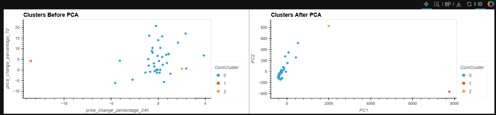
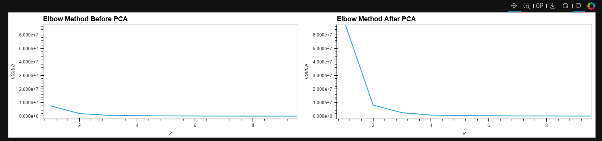

# Cryptocurrency Clustering Analysis

## Project Overview
This project implements advanced machine learning techniques to analyze cryptocurrency market performance data. By utilizing K-means clustering and Principal Component Analysis (PCA), we identify patterns and relationships in cryptocurrency price movements across different timeframes. The analysis provides insights into market segmentation and cryptocurrency behavior groupings.

## Technical Framework

### Core Technologies
- Python
- Scikit-learn for machine learning implementation
- Pandas for data manipulation
- hvPlot for interactive data visualization
- Jupyter Notebooks for analysis environment

### Key Components
- Standardization of price change data across multiple time periods
- Implementation of K-means clustering algorithm
- Dimensionality reduction through Principal Component Analysis
- Comparative analysis of clustering results

## Methodology

### Data Processing
The analysis examines cryptocurrency price changes across seven time periods:
- 24 hours
- 7 days
- 14 days
- 30 days
- 60 days
- 200 days
- 1 year

### Analysis Techniques
1. **Data Standardization**: Implemented StandardScaler to normalize price change data
2. **Optimal Clustering**: Utilized the elbow method to determine the optimal number of clusters
3. **Dimensionality Reduction**: Applied PCA to reduce features while maintaining data integrity
4. **Cluster Analysis**: Compared clustering results before and after PCA application

## Key Findings

### Clustering Analysis
- Identified optimal cluster count (k=3) through elbow curve analysis
- Demonstrated consistent clustering patterns both pre- and post-PCA
- Achieved significant dimensionality reduction while maintaining 99.9% of data variance

### Market Insights
- Discovered distinct cryptocurrency performance groups
- Identified patterns in price movement correlations
- Revealed market segmentation based on price change behaviors

## Visualizations

*Figure 1: Elbow curve analysis for optimal cluster determination*

*Figure 2: Cryptocurrency clusters visualization*

